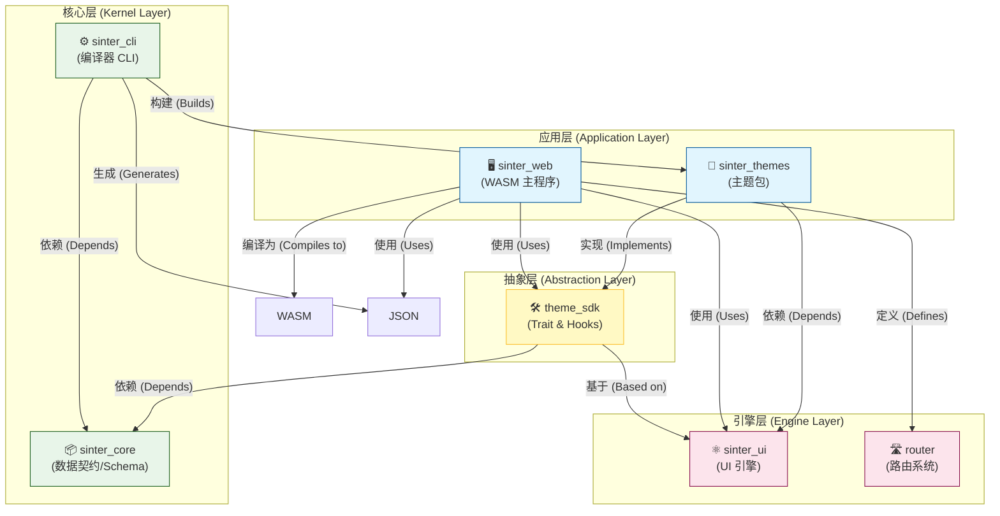
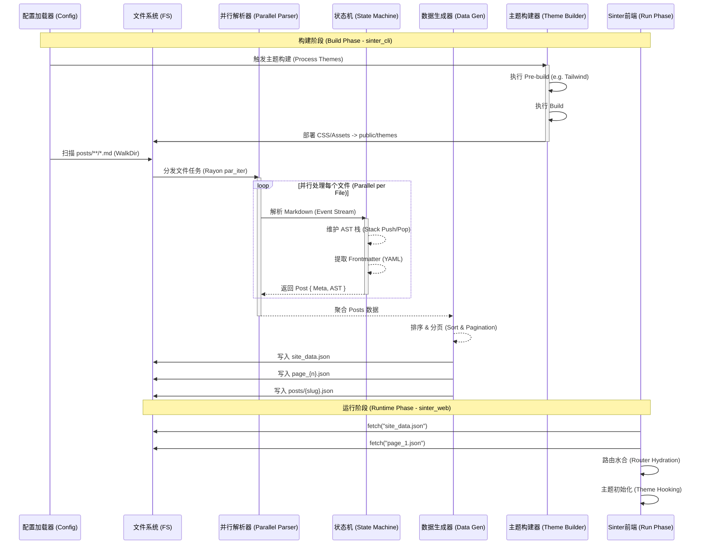
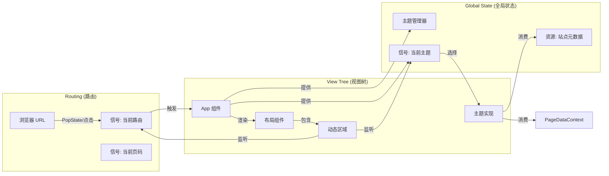

# Sinter 系统架构 (System Architecture)

> **文档状态**: Alpha
> **适用版本**: 2.0.x

本文档详细介绍了 Sinter 的系统架构、设计理念以及各模块之间的交互关系。

## 1. 架构总览 (Architectural Overview)

Sinter 是一个**全栈式 Web 内容编译器**，其核心设计理念是 **"Custom Kernel + Data Compiler"**。与传统的静态站点生成器 (SSG) 不同，Sinter 将内容站点的构建视为一个编译过程：

1.  **输入**: 原始 Markdown 文件和静态资源。
2.  **编译**: 通过 Rust 编写的高性能编译器 (`sinter_cli`) 进行处理。
3.  **输出**: 结构化的 JSON 数据分片 (Data Sharding) 和经过极致压缩的 WebAssembly 应用。
4.  **运行**: 基于自研 UI 引擎 (`sinter_ui`) 的单页应用 (SPA) 在客户端“水合”并动态加载数据。

### 核心优势

*   **极致性能**: 编译期并行处理，运行期无 VDOM 开销。
*   **极小体积**: 核心运行时压缩后仅 ~100KB。
*   **即时交互**: 细粒度响应式系统带来流畅的用户体验。

---

## 2. 系统分层 (System Layering)

Sinter 的架构自底向上分为四层，每一层都定义了明确的职责的边界。



### 2.1 核心层 (Kernel Layer)
*   **`sinter_core`**: 定义了系统的数据契约（Schema），如 `Post`, `SiteMetaData`, `ContentNode` (AST)。它是后端 (CLI) 和前端 (WASM) 之间的通用语言，确保序列化与反序列化的严格对齐。
*   **`sinter_cli`**: 构建工具。负责扫描文件、解析 Markdown 为 AST、生成 JSON 数据分片，并协调主题构建。

### 2.2 引擎层 (Engine Layer)
*   **`sinter_ui`**: 自研的响应式 UI 框架。提供 Signal, Effect, DOM 绑定等原语。
*   **Router**: 位于 `sinter_web/src/router.rs`，是基于 History API 的轻量级路由，负责拦截链接点击并驱动视图切换。

### 2.3 抽象层 (Abstraction Layer)
*   **`theme_sdk`**: 
    *   **Theme Trait**: 定义了主题必须实现的接口 (`render_home`, `render_post` 等)。
    *   **Hooks**: 提供了获取数据的标准钩子 (`use_site_meta`, `use_page_data`)。
    *   **ThemeManager**: 负责主题的注册、动态切换以及 CSS 的懒加载。

### 2.4 应用层 (Application Layer)
*   **`sinter_web`**: 最终的业务宿主。它初始化 `GlobalState`，设置路由，并根据当前 URL 调度 `pages` 模块中的视图，最终调用 `theme_sdk` 渲染 UI。
*   **`sinter_themes`**: 具体的主题实现（如 `DefaultTheme`）。主题是纯粹的 UI 渲染器，通过 `AnyView` 实现多态，完全解耦了业务逻辑。

---

## 3. 构建与编译管线 (Build Pipeline)

Sinter 的构建过程是一个将非结构化文本转换为结构化数据和高效代码的流水线。



---

## 4. UI 引擎与运行机制 (UI Engine & Runtime)

`sinter_ui` 采用了细粒度响应式模型，类似于 SolidJS。`sinter_web` 利用这一引擎构建了一个全动态的 SPA。

### 4.1 运行时对象图 (Runtime Object Graph)



### 4.2 路由与数据加载流程 (Routing & Data Fetching)

当用户点击一个文章链接时：

1.  **Router 拦截**: `router.rs` 捕获 `<a>` 点击，阻止默认跳转，更新 `History` 并 `set_path`。
2.  **路由计算**: `current_route` Memo 重新计算，变为 `Route::Post(slug)`。
3.  **视图切换**: `app.rs` 中的 `match` 表达式检测到路由变化，切换到 `post_view` 组件。
4.  **资源请求**: `post_view` 内部的 `create_resource` 监听到 slug 变化，发起 `fetch_json("/posts/{slug}.json")`。
5.  **Suspense**: 在数据返回前，`Suspense` 边界捕获 loading 状态，显示主题定义的 `render_post_loading`。
6.  **渲染**: JSON 返回后，反序列化为 `Post` 结构体（包含 AST），传递给 `theme.render_post(post)` 进行最终 DOM 生成。

---

## 5. 主题系统设计 (Theme System Design)

主题系统设计为**高内聚、低耦合**的插件模式。

### 5.1 数据流向

```rust
// theme_sdk/src/lib.rs
pub trait Theme {
    // 渲染布局壳子
    fn render_layout(&self, children: Children, meta: ReadSignal<SiteMetaData>) -> AnyView;
    // 渲染具体页面
    fn render_home(&self) -> AnyView;
    fn render_post(&self, post: Post) -> AnyView;
}
```

*   **Type Erasure**: 通过 `AnyView`（包装了 `Box<dyn View>`），主题可以返回任意复杂的 DOM 结构，而主程序无需知晓具体类型。
*   **Isomorphic Data**: `sinter_core` 定义的 `ContentNode` 枚举确保了 AST 节点在前后端的一致性。主题通过 `match node` 模式匹配，将 AST 递归渲染为对应的 HTML 标签（如 `render_node` 函数所示）。
